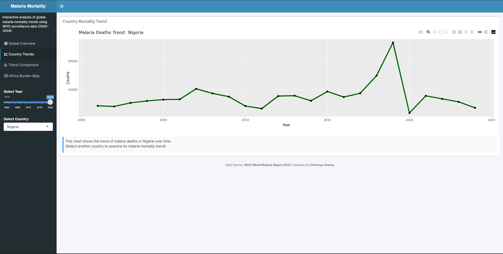
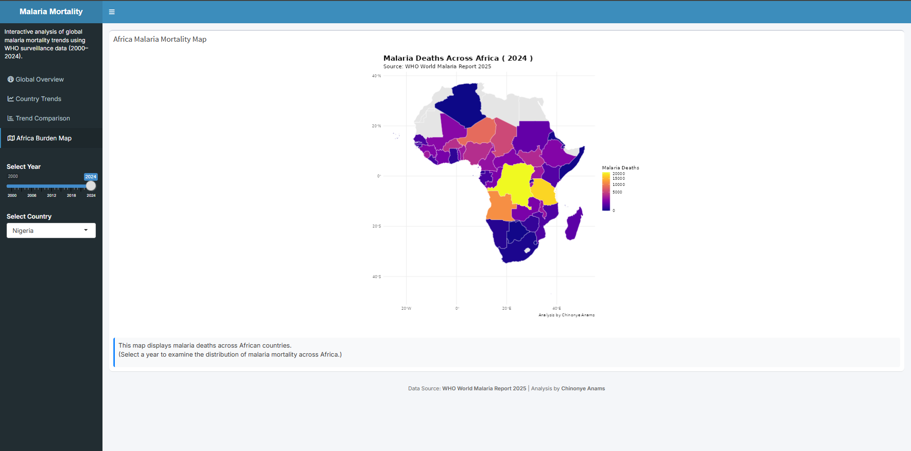

# Global Malaria Mortality Analysis (2001–2024)

Analysis of WHO malaria mortality data across countries and regions, with a focus on long-term trends, geographic distribution, high-burden countries, and Nigeria's contribution to the malaria burden.

**Tools:** R, tidyverse, ggplot2, sf, rnaturalearth, Shiny, Plotly

## Key work

* Cleaned and standardised multi-country malaria mortality data from the WHO World Malaria Report.
* Analysed mortality trends across countries and WHO regions from 2001–2024.
* Examined Nigeria's contribution to malaria mortality.
* Compared high-burden countries and regional patterns.
* Created geospatial maps of malaria mortality across Africa.
* Developed an interactive Shiny dashboard for exploring country-level trends and comparisons.

## Key findings

* Nigeria recorded an average of approximately 7,552 malaria deaths per year between 2001 and 2024.
* Nigeria's recorded malaria mortality declined from 4,317 deaths in 2001 to 3,608 in 2024, a 16.4% reduction.
* The WHO African Region accounted for approximately 96% of global malaria deaths in the dataset.
* Malaria mortality was highly concentrated across a group of high-burden countries, particularly in Central and West Africa.
* Country-level trends varied considerably, with some countries showing increasing mortality despite broader reductions elsewhere.

## Dashboard

**Live interactive dashboard:**
https://chinonyeanams.shinyapps.io/malaria-mortality-dashboard/

The dashboard allows users to:

* Explore mortality trends by country.
* Compare countries and regions.
* Identify high-burden countries.
* Explore geographic patterns across Africa.

## Data source

**WHO World Malaria Report 2025**
Dataset: Annex 4L — Long-format malaria deaths dataset

Variables used include country, WHO region, year, and number of malaria deaths.

## Project structure

```text
01_Malaria_Mortality_Trends_R/
│
├── app.R
├── README.md
├── data/
│   ├── raw/
│   └── processed/
├── R/
│   ├── 01_data_cleaning.R
│   ├── 02_analysis.R
│   ├── 03_visualizations.R
│   └── 04_mapping.R
└── outputs/
    ├── charts/
    ├── maps/
    └── tables/
```

The workflow covers data cleaning, analysis, visualisation, geospatial mapping, and dashboard development.

## Dashboard Preview
### Global Overview


### Country Trend Analysis


### Africa Mortality Map


