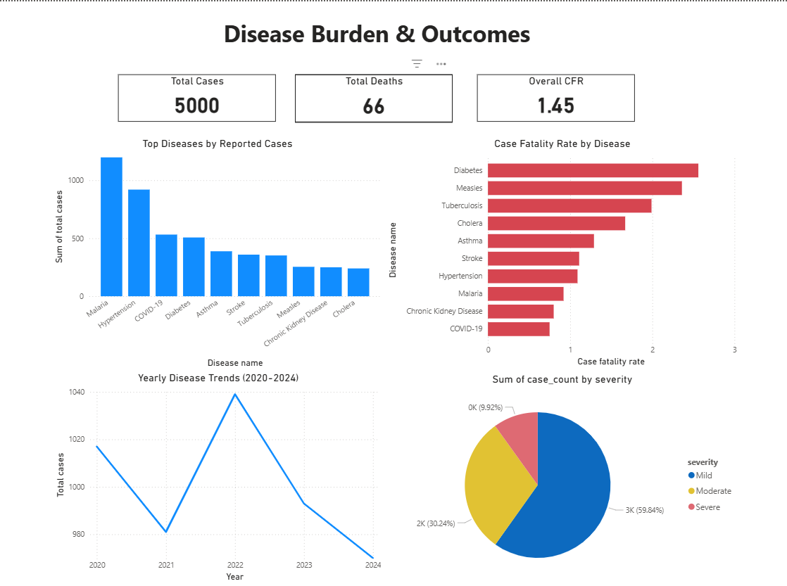
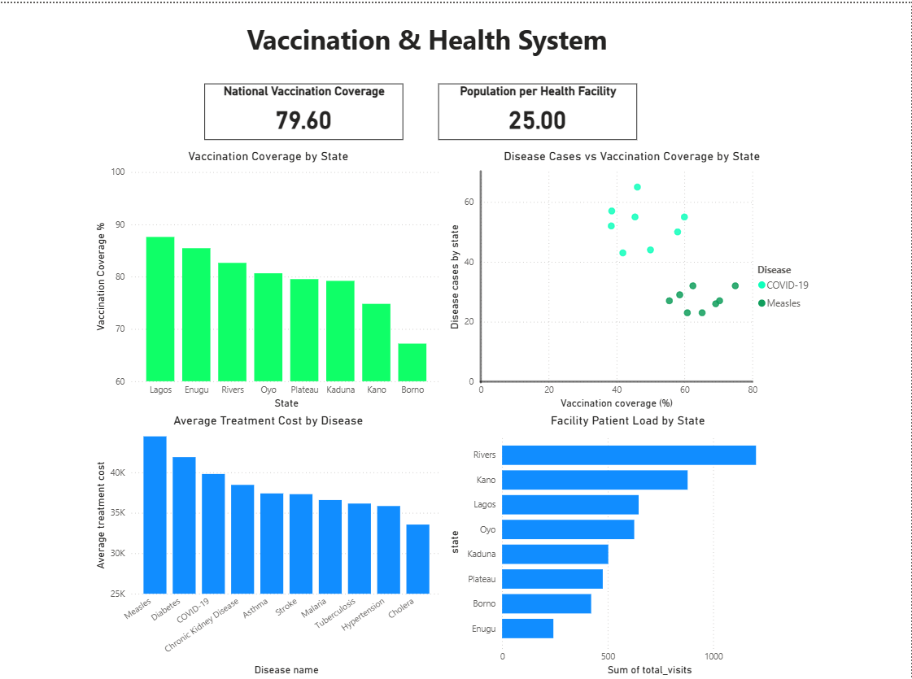

#Public Health Surveillance & Vaccination Analytics System
---

## Dashboard Preview

### 🦠 Disease Burden & Outcomes


### 💉 Vaccination & Health System


---

## Project Overview

This project simulates a national public health surveillance system using synthetic healthcare data.

It demonstrates how SQL and BI tools can be used to:

- Monitor disease burden
- Track vaccination coverage
- Analyze treatment costs
- Detect potential outbreak patterns
- Evaluate health system capacity

The system is built using:

- **SQLite (database & analytics layer)**

- **Python (synthetic data generation)**

- **Power BI (interactive dashboards)**

---

## Project Structure
```
SQL-Health-Data-Analysis/
│
├── README.md
├── .gitignore
│
├── 01_data_generation/
│   └── synthetic_health_data_generator.py
│
├── 02_sql_scripts/
│   ├── 01_production_schema.sql
│   ├── 02_data_validation_checks.sql
│   ├── 03_kpi_views.sql
│   ├── 04_outbreak_detection_queries.sql
│   └── README.md
│
├── 03_csv_data/
│   ├── patients.csv
│   ├── facilities.csv
│   ├── diseases.csv
│   ├── visits.csv
│   ├── vaccinations.csv
│   └── treatments.csv
│
├── 04_sql_views_exports/
│   ├── vw_disease_incidence.csv
│   ├── vw_monthly_cases.csv
│   ├── vw_vaccination_coverage.csv
│   ├── vw_vaccination_by_state.csv
│   ├── vw_case_fatality_rate.csv
│   ├── vw_facility_workload.csv
│   ├── vw_avg_treatment_cost_by_disease.csv
│   ├── vw_severity_distribution.csv
│   ├── vw_top_disease_by_state.csv
│   └── vw_cases_vs_vaccinated_by_state.csv
│
└── 05_powerbi_dashboard/
     ├── Health_Dashboard.pbix
     └── dashboard_screenshots/
         ├── dashboard_preview_1.png
         └── dashboard_preview_2.png
```
---

## Database Design
- **Core Tables**
  - patients
  - visits
  - cases
  - diseases
  - treatments
  - vaccinations
  - facilities
  - states

- **Key Relationships**
  - Patients → Visits
  - Visits → Cases
  - Visits → Treatments
  - Patients → Vaccinations
  - Facilities → States

---

## KPI Views (Analytics Layer)

The project uses SQL Views as a semantic layer for BI reporting.

Key Views:
| View	| Purpose |
| :--- | ---: |
| vw_disease_burden |	Total cases & deaths by disease |
| vw_case_fatality_rate	| CFR by disease |
| vw_yearly_trends | Disease trends (2020–2024) |
| vw_vaccination_coverage	| Vaccination rate by state |
| vw_facility_burden |	Population per facility |
| vw_treatment_cost_analysis |	Avg treatment cost by disease |
| vw_cases_vs_vaccinated_by_state | Diseases case vs vaccination coverage by state |

These views were connected directly into Power BI.

---

## Outbreak Detection Logic

Outbreak detection queries identify:

- Unusual spikes in cases by state

- Year-over-year growth

- States exceeding national average case growth

- High CFR anomalies

This simulates early warning public health surveillance systems.

---

## Dashboard Overview (Power BI)
### Page 1: Disease Burden & Outcomes
#### KPIs

- Total Cases
- Total Deaths
- Overall Case Fatality Rate (CFR)

#### Visualizations

- Top Diseases by Cases
- CFR by Disease
- Yearly Disease Trends
- Case Distribution by Severity

### Page 2: Vaccination & Health System
#### KPIs

- National Vaccination Coverage (%)
- Population per Health Facility

#### Visualizations

- Vaccination Coverage by State
- Disease Cases vs Vaccination Coverage (Scatter)
- Facility Patient Load by State
- Treatment Cost by Disease

---

## Synthetic Data Generation

Data was generated using Python to simulate:

- Realistic disease distributions
- Severity levels (Mild / Moderate / Severe)
- Mortality patterns
- Vaccination coverage variation by state
- Treatment cost variability

Dataset size:

- ~5,000 patients
- Multi-year coverage (2020–2024)

---

## How to Reproduce This Project

1. Run the synthetic data generator:
   python synthetic_health_data_generator.py

2. Import CSVs into SQLite or PostgreSQL

3. Execute SQL scripts in order:
   - 01_production_schema.sql
   - 02_data_validation_checks.sql
   - 03_kpi_views.sql
   - 04_outbreak_detection_queries.sql

4. Load exported views into Power BI

---

## Key Insights

- Certain diseases show higher CFR despite lower case counts.

- States with lower vaccination coverage trend toward higher disease cases.

- Facility burden varies significantly by region.

- Treatment costs differ considerably by disease type.

---

## Tools & Technologies

- SQLite

- DB Browser for SQLite

- Python (Pandas, Random data generation)

- Power BI Desktop

---

## Skills Demonstrated

- Relational schema design

- Data modeling & normalization

- SQL joins & aggregations

- Window functions

- KPI view creation

- Outbreak analytics logic

- BI dashboard design

- Public health data storytelling

---

## Future Improvements

- Add population reference table (true denominator modeling)

- Add age group stratification

- Add seasonal outbreak simulation

- Implement rolling 7-day outbreak detection

- Deploy to PostgreSQL

- Publish dashboard to Power BI Service

---

##Author

**Chinonye Anams**
Public Health Data Analytics Project
2026