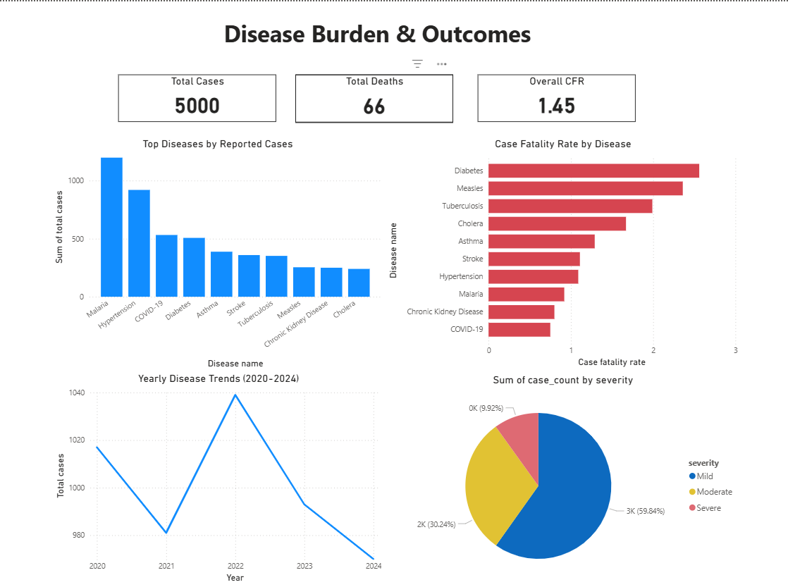
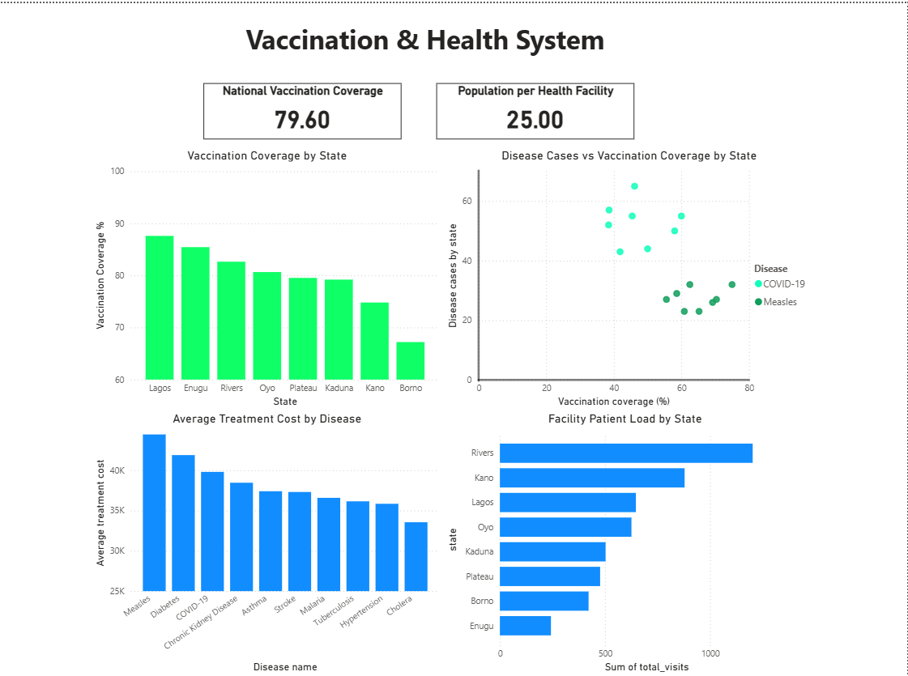

# Public Health Surveillance & Vaccination Analytics System

A simulated national public-health surveillance system demonstrating how healthcare data can be structured, validated, analysed with SQL, and transformed into operational dashboards.

**Tools:** SQLite, SQL, Python, Power BI

**Important:** All healthcare data in this project is synthetic and was created for analytical demonstration. It does not represent real patient records or actual national surveillance data.

## Key work

* Generated a synthetic multi-year healthcare dataset using Python.
* Designed a relational database covering patients, visits, disease cases, vaccinations, treatments, facilities, and states.
* Created SQL validation checks to assess data quality.
* Developed KPI views for disease burden, case-fatality rates, vaccination coverage, facility workload, and treatment costs.
* Developed queries to identify unusual case spikes, year-over-year changes, and potential disease-burden anomalies.
* Built Power BI dashboards for disease outcomes, vaccination coverage, and health-system indicators.

## Key outputs

The SQL analytics layer includes:

* Disease burden and mortality
* Case-fatality rates
* Yearly disease trends
* Vaccination coverage
* Facility workload
* Treatment costs
* Cases compared with vaccination coverage
* Outbreak/anomaly detection indicators

## Dashboard

### Disease Burden & Outcomes



### Vaccination & Health System



## Dataset

The synthetic dataset contains approximately:

* 5,000 patients
* Multiple healthcare facilities
* Multiple disease categories
* Multi-year data covering 2020–2024

The data was generated to demonstrate common healthcare analytics workflows rather than to reproduce real-world disease patterns.

## Project structure

```text
SQL-Health-Data-Analysis/
│
├── README.md
├── .gitignore
│
├── 01_data_generation/
│   └── synthetic_health_data_generator.py
│
├── 02_sql_scripts/
│   ├── 01_production_schema.sql
│   ├── 02_data_validation_checks.sql
│   ├── 03_kpi_views.sql
│   ├── 04_outbreak_detection_queries.sql
│   └── README.md
│
├── 03_csv_data/
│   ├── patients.csv
│   ├── facilities.csv
│   ├── diseases.csv
│   ├── visits.csv
│   ├── vaccinations.csv
│   └── treatments.csv
│
├── 04_sql_views_exports/
│   ├── vw_disease_incidence.csv
│   ├── vw_monthly_cases.csv
│   ├── vw_vaccination_coverage.csv
│   ├── vw_vaccination_by_state.csv
│   ├── vw_case_fatality_rate.csv
│   ├── vw_facility_workload.csv
│   ├── vw_avg_treatment_cost_by_disease.csv
│   ├── vw_severity_distribution.csv
│   ├── vw_top_disease_by_state.csv
│   └── vw_cases_vs_vaccinated_by_state.csv
│
└── 05_powerbi_dashboard/
     ├── Health_Dashboard.pbix
     └── dashboard_screenshots/
         ├── dashboard_preview_1.png
         └── dashboard_preview_2.png
```

The workflow covers synthetic data generation → database design → data validation → SQL analysis → KPI development → Power BI reporting.


