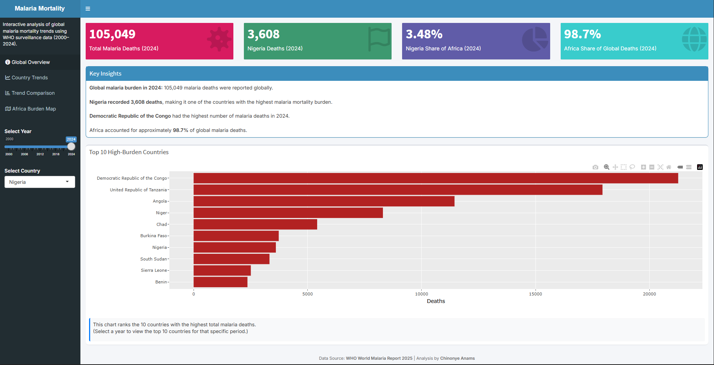

# Public Health Data Analytics Portfolio

  

## Mission
This portfolio showcases applied data analysis projects focused on public health, infectious diseases, and biological data interpretation.

The work demonstrates how computational approaches can support:

- Disease surveillance and outbreak analysis
- Vaccination program monitoring
- Epidemiological trend exploration
- Data-driven understanding of health and disease systems
  
The overall goal is to bridge biological knowledge and data analysis, transforming complex datasets into meaningful insights for research and real-world health impact.

## Portfolio Highlights
- Global malaria mortality analysis (2001–2024)
- Interactive epidemiology dashboard built with R Shiny
- SQL-based public health surveillance analytics system
- Explainable machine learning models for disease risk prediction
- Vaccination coverage and incidence analysis

## Core Capabilities
**Data Analysis for Public Health**
- Cleaning and structuring real-world health and biological datasets
- Epidemiological metric calculation (incidence, CFR, coverage)
- Trend and pattern analysis across populations and regions
- Comparative disease burden analysis
- Translating data into biologically meaningful insights

**Computational Tools Applied to Health & Biology**
- **Excel (Advanced)** – Power Query, PivotTables, dashboards
- **SQL** – Health database design, analytics layers, surveillance queries
- **Python / R** – Data analysis, visualization, modeling
- **Power BI** – Interactive dashboards for decision support

## Featured Projects
These projects demonstrate the application of analytical techniques to disease biology, epidemiology, and health systems data:

| # |Project	| Focus Area	| Tools|
| :--- | :--- | :--- |:--- |
| 1	| [Malaria Mortality Trends in Africa (2001–2024)](https://github.com/NonyeAnams/Public_Health_Analytics_Portfolio/tree/main/01_Malaria_Mortality_Trends_R) |	Disease burden & regional inequality |	R, Shiny|
| 2	| [Measles Vaccination Coverage & Incidence (SSA)](https://github.com/NonyeAnams/Public_Health_Analytics_Portfolio/tree/main/05_Excel_Immunization_Coverage) |	Immunization & population health | Excel |
| 3	| [Public Health Surveillance & Vaccination Analytics System](https://github.com/NonyeAnams/Public_Health_Analytics_Portfolio/tree/main/06_SQL_Health_Database_Analysis) |	Disease monitoring & outbreak detection |	SQL, Python, Power BI |
| 4	| [Heart Disease Risk Prediction (Explainable ML)](https://github.com/NonyeAnams/Public_Health_Analytics_Portfolio/tree/main/02_Cardiovascular_Risk_Prediction) |	Clinical risk modeling	| Python |
| 5	| [Diabetes Risk Prediction](https://github.com/NonyeAnams/Public_Health_Analytics_Portfolio/tree/main/03_Diabetes_Risk_Prediction) |	Preventive health analytics	| Python |
| 6	| [DHIS2-Style Malaria Surveillance mini Project](https://github.com/NonyeAnams/Public_Health_Analytics_Portfolio/tree/main/04_DHIS2_Malaria_Surveillance)	| Routine epidemiological reporting | R |

Each project includes documentation explaining methods, assumptions, and insights, reflecting a focus on transparency and reproducibility.

## Public Health Themes Across Projects
- Infectious disease dynamics
- Vaccination and immunity patterns
- Surveillance system design
- Population-level health analysis
- Data-driven understanding of disease processes

## Background
I am a Molecular Biologist with training in biochemistry, cell biology, and genetics, now expanding into bioinformatics and computational analysis of biological and health data.

My background contributes:

- Strong foundation in biological systems and disease mechanisms
- Scientific reasoning and experimental thinking
- Experience interpreting biological and health-related datasets
- Structured and reproducible analytical workflows

## Current Focus
I am currently developing skills at the intersection of biology and data science, including:

- Bioinformatics and gene expression analysis
- Computational approaches to disease research
- Public health and epidemiological data analysis
- Reproducible data workflows for scientific research

## Tools & Technologies
- **Languages:** R | Python | SQL
- **Analytics & Visualization:** Excel | Power BI | ggplot2 | matplotlib
- **Libraries:** tidyverse | pandas | scikit-learn | SHAP

## Connect with Me

